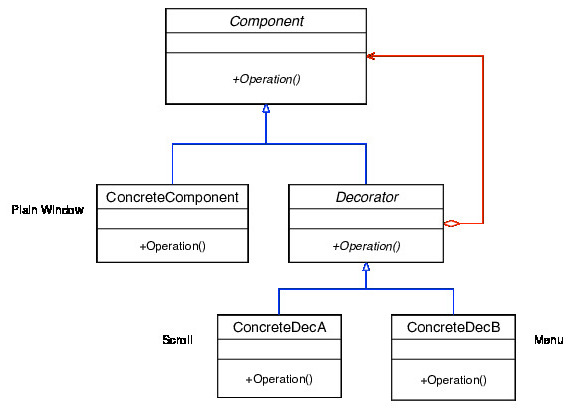

# CS246
# Lecture 18  Exceptions, Design Patterns

## Exceptions

#### Recap 
```cpp
try{
	//...
} catch(SomeExn e){ // catches exceptions of type SomeExn
	throw SomeOtherExn{...}
	throw e;
	throw;
}
```

- All C++ library exceptions inherit from `exception`

- But you do not have to inherit from the exception class

- Need special syntax to catch any kind of exception


```cpp
try{
	//...
} catch(...){ // yes, literally "...". to catch any exception
	//catch everything
}
```

- In C++, you can throw anything

- `excp.cc`

- extremely slow

- good practice: use existing exception classes or create your own

```cpp
class BadInput{};

try{
	int n;
	if(!(cin >> n))throw BadInput{};
} catch(BadInput &){...}
```

- we can catch exception by reference

- no object slicing

- no extra copy constructor called

- Advide: catch by reference (avoid copy constructor & object slicing)

- `out_of_range`

- `bad_alloc` 
	- no more heap memory

- **Never let a destructor throw throw an exception**
	- if an exception occurred, stack unwinding begins	
	- if a destructor is running during stack unwinding & it throws an exception
		- now you have 2 simultaneausly live exceptions
		- program terminates


## Design Patterns

- Object-oriented Design strategy
	- program to an interface & not implementation
	- write abstract base classes to provide an interface
	- use pointers of the abstract base class to call methods

- concrete objects can be swapped in to change behavior

### Observe Pattern

- Used to support a publish/subscribe model

- **subject**: generate data (publisher)
- **obsevers**: interested in data (subscriber)


- `2-observer/`


- if a class needs to be *abstract*, but there is no *pure virtual* method, make the destructor *pure virtual*

// why the class needs to be P.V.? in what condition?

- still need to implement this pure virtual destructor 
	- because subclass object's destructor will automatically call base class's destructor

- a *pure virtual* method is one that must be implemented by the subclass if the subclass needs to be concrete.

### Decorator Pattern

- to decorate objects

- add behavior functionality to an existing object



- Decorator is a component and has a component

- A window with a scroll bar & a menu has a window with a menu which has a menu
- `Window *w = new Scroll(new Menu(new PlainWindow))`
